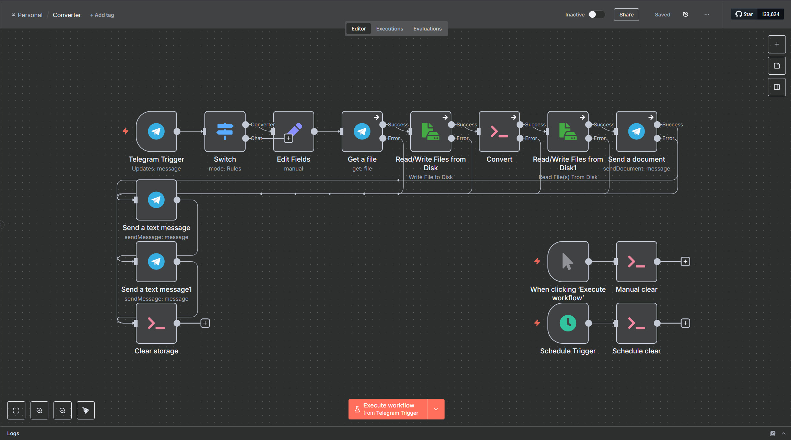
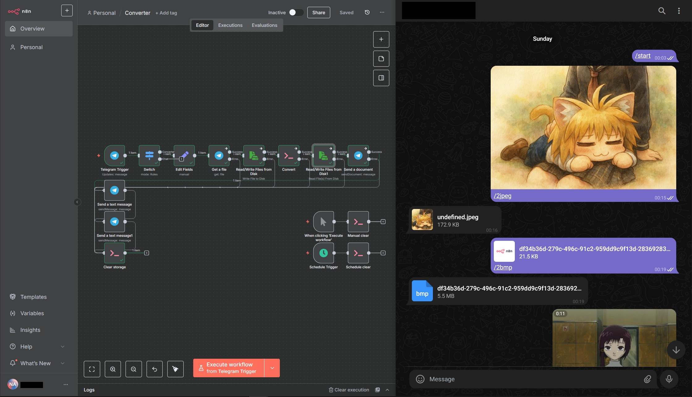
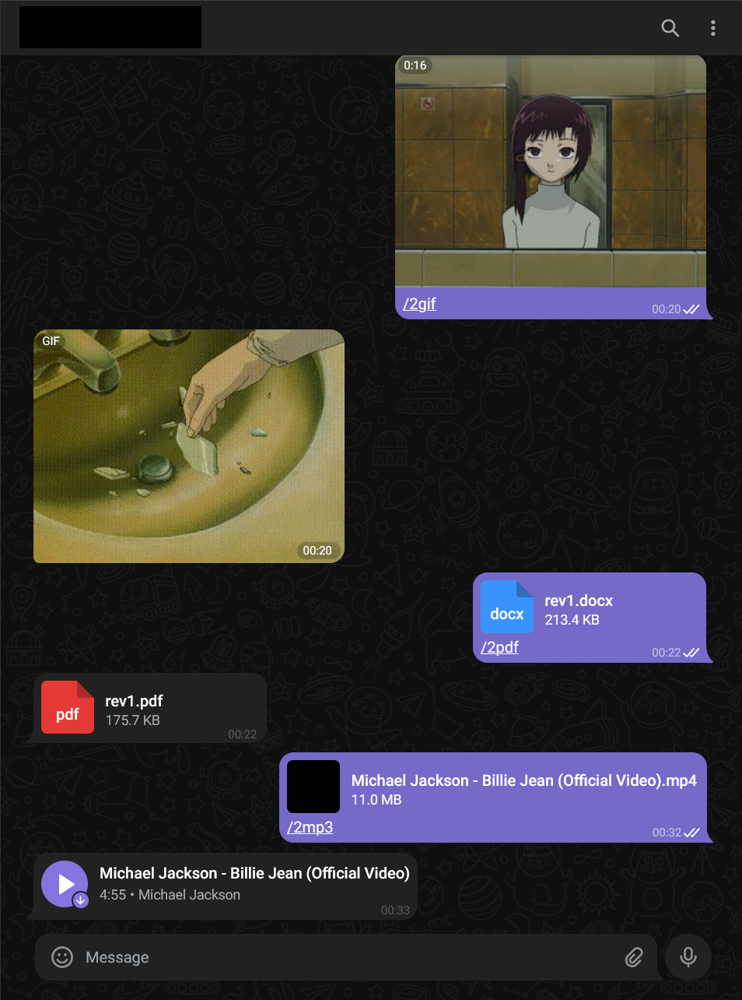

# Установка libreoffice и ffmpeg в N8N для конвертации файлов

Это руководство поможет вам добавть libreoffice и ffmpeg в N8N через Dockerfile.

## Шаг 1: Создание отдельной директории для хранения загуженных и сконвертированных файлов

Перейдите в директорию с вашим N8N, остановите контейнеры если они работают и создайте папку с соответствующими правами на чтение и запись:

```bash
cd ~/n8n-compose
sudo docker-compose down
mkdir -p local-files/Convert
sudo chown -R 1000:1000 local-files
sudo chmod -R 775 local-files
```

---

## Шаг 2: Создание Dockerfile

  1. В той же директории создайте Dockerfile:

```bash
cd ~/n8n-compose
sudo nano Docker
```
  2. И вставьте в него следующее содержимое:
```bash
FROM n8nio/n8n:latest

USER root

RUN apk update && apk add --no-cache \
    ffmpeg \
    libreoffice

USER node

```
---

## Шаг 3: Редактирование docker-compose.yml

  1. В той же директории откройте ваш docker-compose.yml:
```bash
cd n8n-compose
sudo nano docker-compose.yml
```
  2. И приведите его содержимое к следющему виду, заменив yourservername на своё доменное имя или порт localhost:
```bash
services:
  n8n:
    build:
      context: .
      dockerfile: Dockerfile
    image: n8n
    restart: always
    ports:
      - "5678:5678"
    environment:
      - N8N_PORT=5678
      - N8N_PROTOCOL=https
      - NODE_ENV=production
      - WEBHOOK_URL=https://yourservername/
      - GENERIC_TIMEZONE=Europe/Berlin
      - NODE_OPTIONS=--max-old-space-size=4096 # Увеличение используемой памяти Node, если на вашем сервере меньше 4 GB ОЗУ, то уменьшите занчение до 1024/2048 соответственно. 
      - N8N_DEFAULT_BINARY_DATA_MODE=filesystem # Позволяет N8N использовать файловую систему для работы c Binary data вместо ОЗУ, что значительно увеличивает объём обрабатываемых данных
    volumes:
      - n8n_data:/home/node/.n8n
      - ./local-files:/files

volumes:
  n8n_data:

```
## Шаг 4 Пересоберите контейнеры: 
```bash
cd ~/n8n-compose
sudo docker compose up -d --build
```   
## Шаг 5 Проверка работы libreoffice и ffmpeg:
  1. Для проверки libreoffice и ffmpeg я предлагаю вам попробывать готовый и удобный workflow для конвертации медиа и документов через Telegram:



  2. Скопируйте или импортируйте через файл .json workflow ниже:
  
```bash
{
  "nodes": [
    {
      "parameters": {
        "operation": "sendDocument",
        "chatId": "={{ $('Telegram Trigger').item.json.message.chat.id }}",
        "binaryData": true,
        "additionalFields": {}
      },
      "type": "n8n-nodes-base.telegram",
      "typeVersion": 1.2,
      "position": [
        1152,
        -240
      ],
      "id": "e172d57f-e586-4bb7-a7b0-d64c02752859",
      "name": "Send a document",
      "alwaysOutputData": false,
      "credentials": {
        "telegramApi": {
          "id": "lePjKxXWZTkDMhUj",
          "name": "Telegram account"
        }
      },
      "onError": "continueErrorOutput"
    },
    {
      "parameters": {
        "chatId": "={{ $('Telegram Trigger').item.json.message.from.id }}",
        "text": "=Ошибка при отправке/получени файла. Размер файла превышает 20/50 МБ!\n\nError upon sending/receiving file. The file size exceeds 20/50 MB!",
        "additionalFields": {
          "appendAttribution": false
        }
      },
      "type": "n8n-nodes-base.telegram",
      "typeVersion": 1.2,
      "position": [
        32,
        -80
      ],
      "id": "cfdd07f6-d4cb-4231-9d97-82ec725d7c60",
      "name": "Send a text message",
      "credentials": {
        "telegramApi": {
          "id": "lePjKxXWZTkDMhUj",
          "name": "Telegram account"
        }
      }
    },
    {
      "parameters": {
        "assignments": {
          "assignments": [
            {
              "id": "1283f59f-40a9-4f11-8c84-62c28b55906a",
              "name": "file_mime_type",
              "value": "={{ $('Telegram Trigger').item.json.message.document?.mime_type || $('Telegram Trigger').item.json.message.audio?.mime_type || $('Telegram Trigger').item.json.message.video?.mime_type || 'image/jpeg' }}",
              "type": "string"
            },
            {
              "id": "39efeab5-68e2-43b2-ac50-7f5d8b89219b",
              "name": "file_id",
              "value": "={{ $('Telegram Trigger').item.json.message.document?.file_id || $('Telegram Trigger').item.json.message.audio?.file_id || $('Telegram Trigger').item.json.message.video?.file_id || $('Telegram Trigger').item.json.message.photo[$('Telegram Trigger').item.json.message.photo.length - 1].file_id }}",
              "type": "string"
            },
            {
              "id": "8f41aca1-3d3d-4a87-b513-bc1c2d262d55",
              "name": "file_name",
              "value": "={{ $('Telegram Trigger').item.json.message.document?.file_name || $('Telegram Trigger').item.json.message.audio?.file_name || $('Telegram Trigger').item.json.message.video?.file_name || $json.file_id + '.jpg' }}",
              "type": "string"
            },
            {
              "id": "601e1114-4d30-4f6e-932b-ff32e931e98b",
              "name": "target_format",
              "value": "={{ $('Telegram Trigger').item.json.message.caption.substring(2) }}",
              "type": "string"
            },
            {
              "id": "a9a5c97e-9834-41b9-9439-ed618876891d",
              "name": "base_name",
              "value": "={{ ((fileName) => { const dotIndex = fileName ? fileName.lastIndexOf('.') : -1; return dotIndex > 0 ? fileName.substring(0, dotIndex) : fileName; })( $('Telegram Trigger').item.json.message.document?.file_name || $('Telegram Trigger').item.json.message.audio?.file_name || $('Telegram Trigger').item.json.message.video?.file_name ) || $json.file_id + '' }}",
              "type": "string"
            },
            {
              "id": "efa20d86-8716-4e53-956f-ddcb00842b1f",
              "name": "current_format",
              "value": "={{ $('Telegram Trigger').item.json.message.caption.substring(2) }}",
              "type": "string"
            }
          ]
        },
        "options": {}
      },
      "id": "5e42e472-4271-49b8-a6ff-7073f4dfe924",
      "name": "Edit Fields",
      "type": "n8n-nodes-base.set",
      "typeVersion": 3.4,
      "position": [
        352,
        -240
      ]
    },
    {
      "parameters": {
        "resource": "file",
        "fileId": "={{ $('Edit Fields').item.json.file_id }}",
        "additionalFields": {}
      },
      "type": "n8n-nodes-base.telegram",
      "typeVersion": 1.2,
      "position": [
        512,
        -240
      ],
      "id": "6e0c3440-1f6f-4fd9-82cb-7aff899686d2",
      "name": "Get a file",
      "credentials": {
        "telegramApi": {
          "id": "lePjKxXWZTkDMhUj",
          "name": "Telegram account"
        }
      },
      "onError": "continueErrorOutput"
    },
    {
      "parameters": {
        "updates": [
          "message"
        ],
        "additionalFields": {}
      },
      "type": "n8n-nodes-base.telegramTrigger",
      "typeVersion": 1.2,
      "position": [
        32,
        -240
      ],
      "id": "74eb2f65-c5b6-46bb-91ca-61ab41f5dfdf",
      "name": "Telegram Trigger",
      "credentials": {
        "telegramApi": {
          "id": "lePjKxXWZTkDMhUj",
          "name": "Telegram account"
        }
      }
    },
    {
      "parameters": {
        "rule": {
          "interval": [
            {
              "field": "minutes",
              "minutesInterval": 15
            }
          ]
        }
      },
      "type": "n8n-nodes-base.scheduleTrigger",
      "typeVersion": 1.2,
      "position": [
        992,
        208
      ],
      "id": "b9b08a9a-9169-47e9-9c75-df87a3bb779e",
      "name": "Schedule Trigger"
    },
    {
      "parameters": {},
      "type": "n8n-nodes-base.manualTrigger",
      "typeVersion": 1,
      "position": [
        992,
        64
      ],
      "id": "121808eb-5a00-487f-98b0-1426544251b7",
      "name": "When clicking ‘Execute workflow’"
    },
    {
      "parameters": {
        "rules": {
          "values": [
            {
              "conditions": {
                "options": {
                  "caseSensitive": true,
                  "leftValue": "",
                  "typeValidation": "strict",
                  "version": 2
                },
                "conditions": [
                  {
                    "leftValue": "={{ $('Telegram Trigger').item.json.message.caption }}",
                    "rightValue": "/2",
                    "operator": {
                      "type": "string",
                      "operation": "contains"
                    },
                    "id": "47ffac03-3f52-4b3c-aaac-b3d00c5dfc6f"
                  }
                ],
                "combinator": "and"
              },
              "renameOutput": true,
              "outputKey": "Converter"
            },
            {
              "conditions": {
                "options": {
                  "caseSensitive": true,
                  "leftValue": "",
                  "typeValidation": "strict",
                  "version": 2
                },
                "conditions": [
                  {
                    "id": "6a278e0a-fac6-4767-84d6-3c5d4a8ac88f",
                    "leftValue": "={{ $('Telegram Trigger').item.json.message.caption }}",
                    "rightValue": "=/2 {{ $json.message.photo[0] }}{{ $json.message.photo[1] }}{{ $json.message.photo[2] }}{{ $json.message.photo[3] }}",
                    "operator": {
                      "type": "string",
                      "operation": "notContains"
                    }
                  }
                ],
                "combinator": "and"
              },
              "renameOutput": true,
              "outputKey": "Chat"
            }
          ]
        },
        "options": {}
      },
      "type": "n8n-nodes-base.switch",
      "typeVersion": 3.2,
      "position": [
        192,
        -240
      ],
      "id": "a60b3be5-7efb-4411-a833-ae0ed66e7ab1",
      "name": "Switch"
    },
    {
      "parameters": {
        "operation": "write",
        "fileName": "=/files/Convert/{{ $('Edit Fields').item.json.file_name }}",
        "options": {}
      },
      "type": "n8n-nodes-base.readWriteFile",
      "typeVersion": 1,
      "position": [
        672,
        -240
      ],
      "id": "35a2e25f-6fb4-4c73-b17e-9f9861684fbe",
      "name": "Read/Write Files from Disk",
      "onError": "continueErrorOutput"
    },
    {
      "parameters": {
        "fileSelector": "=/files/Convert/{{ $('Edit Fields').item.json.base_name }}.{{ $('Edit Fields').item.json.target_format }}",
        "options": {}
      },
      "type": "n8n-nodes-base.readWriteFile",
      "typeVersion": 1,
      "position": [
        992,
        -240
      ],
      "id": "6246bb82-246c-4d33-9ecd-4be9126f6b58",
      "name": "Read/Write Files from Disk1",
      "onError": "continueErrorOutput"
    },
    {
      "parameters": {
        "chatId": "={{ $('Telegram Trigger').item.json.message.from.id }}",
        "text": "=Ошибка конвертации!/Conversion error!",
        "additionalFields": {
          "appendAttribution": false
        }
      },
      "type": "n8n-nodes-base.telegram",
      "typeVersion": 1.2,
      "position": [
        32,
        64
      ],
      "id": "266b7849-d1be-4211-8fe7-2e49a031769d",
      "name": "Send a text message1",
      "credentials": {
        "telegramApi": {
          "id": "lePjKxXWZTkDMhUj",
          "name": "Telegram account"
        }
      }
    },
    {
      "parameters": {
        "command": "=if [[ \"{{ $('Edit Fields').item.json.file_mime_type }}\" == application* ]]; then\n  libreoffice --headless --convert-to {{ $('Edit Fields').item.json.target_format }} --outdir /files/Convert \"/files/Convert/{{ $('Edit Fields').item.json.file_name }}\"\nelse\n  PARAMS=\"\"\n  if [[ \"{{ $('Edit Fields').item.json.file_mime_type }}\" == audio* ]]; then\n    PARAMS=\"-vn -b:a 320k\"\n  fi\n  ffmpeg -i \"/files/Convert/{{ $('Edit Fields').item.json.file_name }}\" $PARAMS \"/files/Convert/{{ $('Edit Fields').item.json.base_name }}.{{ $('Edit Fields').item.json.target_format }}\"\nfi"
      },
      "type": "n8n-nodes-base.executeCommand",
      "typeVersion": 1,
      "position": [
        832,
        -240
      ],
      "id": "a435d3a1-842a-465d-9217-fbed4bd1fa03",
      "name": "Convert",
      "onError": "continueErrorOutput"
    },
    {
      "parameters": {
        "command": "=find /files/Convert/ -mindepth 1 -delete"
      },
      "type": "n8n-nodes-base.executeCommand",
      "typeVersion": 1,
      "position": [
        32,
        208
      ],
      "id": "08726aa3-1981-4e87-92b8-6d01bf1fd3c2",
      "name": "Clear storage"
    },
    {
      "parameters": {
        "command": "=find /files/Convert/ -mindepth 1 -delete"
      },
      "type": "n8n-nodes-base.executeCommand",
      "typeVersion": 1,
      "position": [
        1152,
        64
      ],
      "id": "90fc7c00-1f3f-49cd-8470-89863f096bf9",
      "name": "Manual clear"
    },
    {
      "parameters": {
        "command": "=find /files/Convert/ -mindepth 1 -delete"
      },
      "type": "n8n-nodes-base.executeCommand",
      "typeVersion": 1,
      "position": [
        1152,
        208
      ],
      "id": "5ec6ce7b-6bc2-4836-9a02-882535fe12f4",
      "name": "Schedule clear"
    }
  ],
  "connections": {
    "Send a document": {
      "main": [
        [
          {
            "node": "Clear storage",
            "type": "main",
            "index": 0
          }
        ],
        [
          {
            "node": "Send a text message",
            "type": "main",
            "index": 0
          }
        ]
      ]
    },
    "Send a text message": {
      "main": [
        [
          {
            "node": "Clear storage",
            "type": "main",
            "index": 0
          }
        ]
      ]
    },
    "Edit Fields": {
      "main": [
        [
          {
            "node": "Get a file",
            "type": "main",
            "index": 0
          }
        ]
      ]
    },
    "Get a file": {
      "main": [
        [
          {
            "node": "Read/Write Files from Disk",
            "type": "main",
            "index": 0
          }
        ],
        [
          {
            "node": "Send a text message",
            "type": "main",
            "index": 0
          }
        ]
      ]
    },
    "Telegram Trigger": {
      "main": [
        [
          {
            "node": "Switch",
            "type": "main",
            "index": 0
          }
        ]
      ]
    },
    "Schedule Trigger": {
      "main": [
        [
          {
            "node": "Schedule clear",
            "type": "main",
            "index": 0
          }
        ]
      ]
    },
    "When clicking ‘Execute workflow’": {
      "main": [
        [
          {
            "node": "Manual clear",
            "type": "main",
            "index": 0
          }
        ]
      ]
    },
    "Switch": {
      "main": [
        [
          {
            "node": "Edit Fields",
            "type": "main",
            "index": 0
          }
        ],
        []
      ]
    },
    "Read/Write Files from Disk": {
      "main": [
        [
          {
            "node": "Convert",
            "type": "main",
            "index": 0
          }
        ],
        [
          {
            "node": "Clear storage",
            "type": "main",
            "index": 0
          }
        ]
      ]
    },
    "Read/Write Files from Disk1": {
      "main": [
        [
          {
            "node": "Send a document",
            "type": "main",
            "index": 0
          }
        ],
        [
          {
            "node": "Clear storage",
            "type": "main",
            "index": 0
          }
        ]
      ]
    },
    "Send a text message1": {
      "main": [
        [
          {
            "node": "Clear storage",
            "type": "main",
            "index": 0
          }
        ]
      ]
    },
    "Convert": {
      "main": [
        [
          {
            "node": "Read/Write Files from Disk1",
            "type": "main",
            "index": 0
          }
        ],
        [
          {
            "node": "Send a text message1",
            "type": "main",
            "index": 0
          }
        ]
      ]
    }
  },
  "pinData": {},
  "meta": {
    "templateCredsSetupCompleted": true
  }
}
```
  2. Подключите/создайте Telegram credentials с токеном вашего бота, запустите и попробуйте допустим отправить видео, ОБЯЗАТЕЛЬНО С ПОДПИСЬЮ /2gif, аналогично можно сконвекрировать .docx документ в .pdf прикрепив его с командой /2pdf и тд. Ниже представленны примеры конверации файлов:



Обратите внимание, что файлы можно прикреплять как файлом, так и как медиа:



## Ограничения.

  1.Как таковых ограничений у libreoffice и ffmpeg нет, но они есть например у Telegram в 20 и 50 МБ на загрузку и отправку соответственно + если на вашем N8N сервере используется Redis, то убедитесь, что он запущен в одной docker сети, что и n8n, иначе параметр N8N_DEFAULT_BINARY_DATA_MODE=filesystem может вызвать конфликт или краш N8N или Redis при большой нагрузке из-за нехватки ОЗУ.
  
  2.Ещё можно отметить ограничение самого workflow, а именно - конвертация только одного файла за раз. (В последующих итерациях постараюсь добавить обработку нескольких файлов).

  3. Если вы поднимали N8N в виртуальной машине по гайду из https://github.com/SIBNECO/n8n-local-to-public, то убедитьесь, что вашей ВМ выделенно более 25 ГБ ибо на сервере вскоре может нехвать места после установки libreoffice и ffmpeg.
